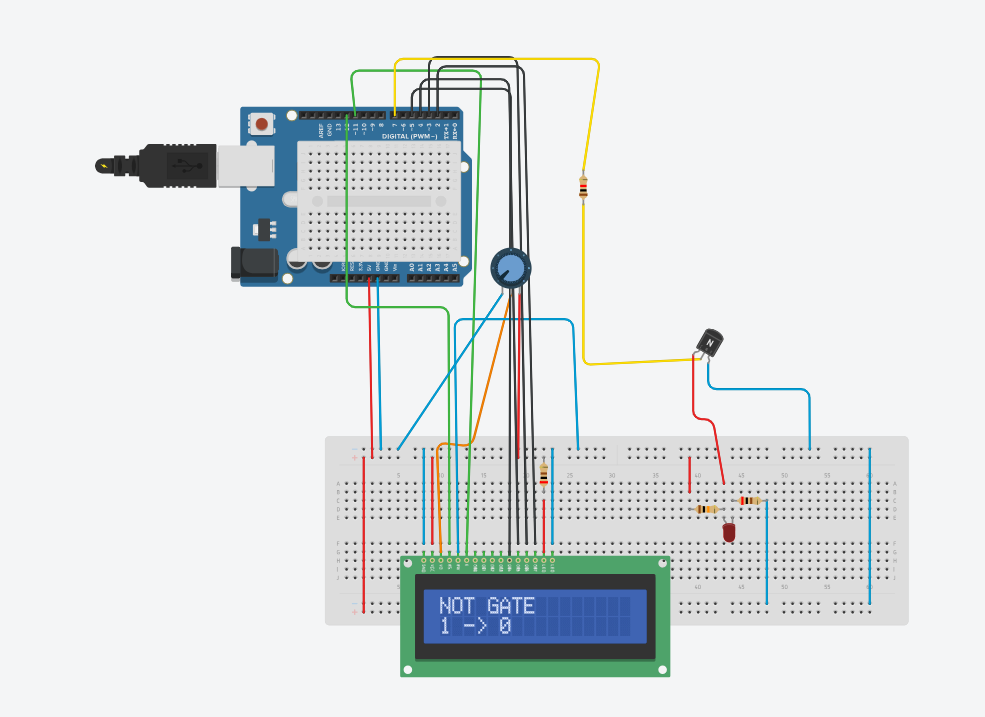
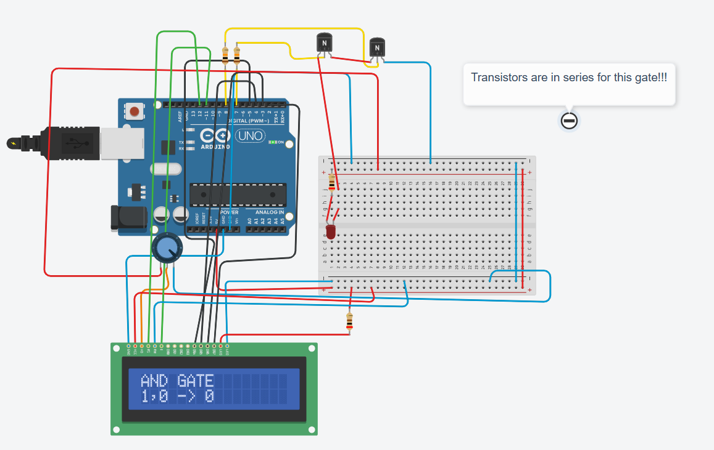
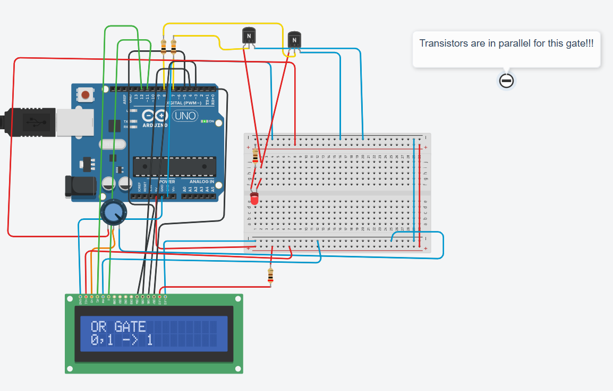

# Transistor-Logic-Gates
In this project, I will use individual transistors to create 3 fundamental logic gates: the AND, OR, and NOT gates, respectively.

# Introduction
The foundation of this project is the transistor, which amplifies and switches signals. Here I am specifically referring to an NPN Bipolar Junction Transistor. The NPN transistor is constructed with two semiconductor types, a P-type and an N-type, where the majority charge carriers are holes and electrons, respectively. The NPN transistor has 3 pins: the base, emitter, and collector. The principle is that a small current (limited by a resistor) is applied from the base to the emitter, which in turn drives a large current from the collector to the emitter. These transistors can be used to construct logic gates and hence truth tables. The truth tables were displayed on an LCD screen.

# NOT Gate
The first gate is the NOT gate (inverter), which outputs a low signal when it takes in a high signal and vice versa. The NOT gate was constructed by placing the output on a separate path with a high resistance. When the base signal is low, the current flows through that path. When the base signal is high, the current takes the path of least resistance and flows through the transistor, leaving the output low. 

# Code for NOT Gate
[NOT Gate Code](NOT_GATE.ino)

# AND Gate
This gate requires two transistors; this gate will only output high if both input signals are high. This was constructed by placing two transistors in series, this entailed connecting the emitter of the first transistor to the collector of the second, and the second emitter was then connected to ground. This circuit works because there is only one path to flow, hence both input signals need to be high for the circuit to be complete.

# Code for AND Gate
[AND Gate Code](AND_GATE.ino)

# Demo for AND Gate
[AND Gate Demo Video](https://youtube.com/shorts/YErGVFN6hGg?si=8YeepXTUk0qU_tc1)

# OR Gate
Similar to the AND gate, this gate needs two transistors; this time, placed in parallel to each other. Unlike the AND gate, the OR gate outputs high when at least one of the input signals is high. This works since the parallel connections provide separate paths for the current to flow.

# Code for OR Gate
[OR Gate Code](OR_GATE.ino)

# Demo for OR Gate
[OR Gate Demo Video](https://youtube.com/shorts/au-O7nDR0IY?si=40i91kdoC_72VvdB)

# Component List
1. 2 NPN transistors
2. 1000, 10000, and 200 ohm resistors
3. LCD Screen
4. ELEGOO Uno Microcontroller
5. Potentiometer
6. C++ based Arduino IDE
7. LED for the output

# Usage
Assemble the circuits above, while double-checking every step. Ensure that 5V is never connected directly to ground. Upload the respective programs for each circuit using the Arduino IDE. Watch the truth table on the LCD screen.

# Common Issues
1. Mixing up the emitter and the collector, as it changed depending on the specific model
2. Using a resistor with a small resistance for the base current input
3. Loose wires
4. Common ground being disconnected

